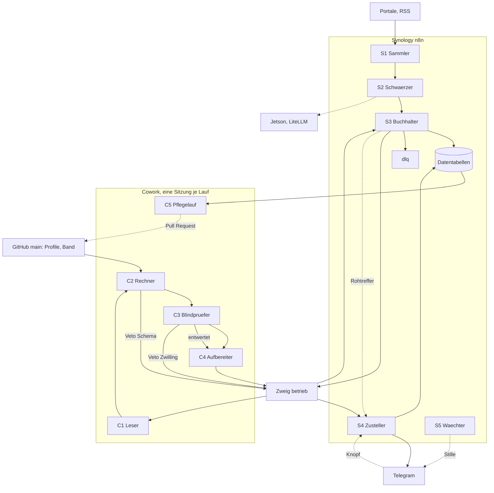

# Kapitel 2. Zielarchitektur und Agentenrollen

Geschrieben gegen die Regeln R1 bis R24 aus Kapitel 1.

## 2.1 Zwei Befunde

**B1 Zeit schlägt Gründlichkeit.** Wer um 07:10 anfragt, bekommt den Termin, wer um 11:00 die Warteliste. Im Entscheidungsmoment läuft deshalb kein Modell mehr: Der Nachtlauf schreibt Maklernachricht, Unterlagenliste und Besichtigungsfragen im Voraus.

**B2 Der teure Fehler ist der nicht gezeigte Treffer.** Ein falsch positiver kostet dreißig Sekunden Lesezeit, ein falsch negativer die Wohnung, und niemand bemerkt ihn. Die Gegenprüfung gehört auf die Verworfenen.

## 2.2 Platzierung

Was nicht ausfallen darf, läuft in n8n, denn ein verpasstes Angebot ist unwiederbringlich. Was Urteil braucht, läuft in Cowork, wo jede geplante Aufgabe eine eigene Sitzung startet [2]. Was Klarnamen berührt, bleibt auf dem Jetson (R19). **Aufnahme und Urteil sind entkoppelt:** Ein gescheiterter Lauf verzögert ein Urteil, er verliert nie ein Angebot.

**Warum C1 und C2 in Cowork liegen, und wann nicht.** Die Frage ist berechtigt, denn C2 ist modellfrei und C1 könnte gegen das lokale Modell laufen. Drei Gründe sprechen für Cowork, einer dagegen.

| Rolle | Grund für Cowork | Grund dagegen |
|---|---|---|
| C1 Leser | langes Fenster, verlässliche Schemaausgabe, Sub-Agent mit eigenem Kontext; das Jetson-Modell füllt nach Kapitel 5.7 nur eine Positivliste und keine Zahlenfelder | ein weiterer Laufzeitübergang je Lauf |
| C2 Rechner | liegt im selben Lauf wie C1 und C3, deshalb ohne zusätzliche Übergabe; die Schemaprüfung braucht das Ergebnis von C1 unmittelbar | ein deterministischer Schritt gehört in einen n8n-Code-Knoten |

**Der Rückfallpfad ist benannt und wird nicht improvisiert.** Fällt eine der vier offenen Cowork-Eigenschaften aus Kapitel 8.5 anders aus als angenommen, gilt je Eigenschaft eine feste Handlung.

| Offene Eigenschaft | Handlung, falls sie nicht hält |
|---|---|
| freie Cron-Ausdrücke, Zeitbasis | Stufe „daily", Zustellzeit steuert S4 in Ortszeit (Kapitel 5.1) |
| harte Trennung der Sub-Agenten-Kontexte | C3 wird eine eigene geplante Aufgabe mit eigener Sitzung; die Blindheit entsteht dann aus der Sitzungsgrenze statt aus der Kontextgrenze |
| monatlicher Takt | wöchentliche Aufgabe mit Datumsprüfung als erstem Schritt |
| Abrechnung je Lauf | Kostenmessung über die Objektzahl (I4) statt über eine Laufabrechnung; die Kostenabnahme A2.8 misst dann Token, nicht Rechnungsposten |

Halten zwei dieser vier Eigenschaften nicht, greift die Variante **V1** aus Abschnitt 2.10: C1 wandert als LiteLLM-Aufruf in n8n, C2 in einen Code-Knoten, Cowork behält nur C5 und die Vertiefung. Diese Bewegung ist vorgesehen und kostet nach Kapitel 7 zwischen 3 und 6 Stunden.

**Die Einbahnstraße der Ausdruckskraft.** R20 sagt: Exposé und Mail sind Daten, nie Anweisung. Prüfbar wird das erst durch Stufen. Rohtext sehen nur S1, S2 und C1. C1 macht daraus Schemafelder mit Zitaten von höchstens 200 Zeichen, Prosa nur in Textfeldern (R24). **C2 und C3 sehen nur Werte, Stichtage, Feldzustände (R6), Belegzitate und Belegklassen (R1), niemals den Quelltext.** Wer Fremdtext sieht, kennt die Regeln nicht; wer die Regeln kennt, sieht keinen Fremdtext. Diese Einbahnstraße gilt ohne Ausnahme, auch für die Gegenprüfung in Kapitel 6.1.

## 2.3 Die Rollen

Neun im Tagesbetrieb plus ein Pflegelauf; fünf ohne Modell. **Keine Cowork-Rolle hat ein Werkzeug mit Außenwirkung**, Telegram gehört S4. So wird R12 zur Rechtevergabe: Das System sortiert und begründet, kontaktiert niemanden, unterschreibt nichts.

| Rolle, Ort, Takt | Eingabe → Ausgabe, Werkzeug | Fehlerfall, Eskalation |
|---|---|---|
| **S1 Sammler**, n8n, 15 Min | Postfach, RSS → Rohsatz, kanonisiert (Kapitel 6); IMAP-Node [3] | drei Versuche, dann Quelle aus; Fehler-Workflow nennt den Knoten [1] |
| **S2 Schwärzer**, n8n auf Jetson | Rohsatz → geschwärzt, Ort auf Zone; lokales Modell [4] | im Zweifel weiter schwärzen, sonst Quarantäne |
| **S3 Buchhalter**, n8n, 15 Min | Satz, Bündel, Knopf → Ereignis, Akte, Ziffernbilanz (Kapitel 6); Data Table [7] | Widerspruch bleibt stehen (R15); Bündel dreimal zurückgefallen → `dlq` |
| **S4 Zusteller**, n8n, ab 07:00 und laufend | Akte, Rohtreffer → Digest, Sofortmeldung; Telegram [5] | stumm: Wiederholung, Digest bleibt Datei |
| **S5 Wächter**, n8n, 07:10 | Herzschlag, Median → Alarm; Data Table, Telegram | hängt an keiner Ergebnisdatei |
| **C1 Leser**, Cowork, Sub-Agent | geschwärzter Text → Felder, Belegzitat, Belegklasse, Lücken (R7); keins | einmal neu, dann Quarantäne; Häufung: ESK2 |
| **C2 Rechner**, Cowork, Skript | Felder, Profil, Band → Rang, Belegdichte (R8), Zitatanker, Schemaprüfung, **Veto** nach R18 (Kapitel 6); modellfrei | Band überfällig: „nicht ermittelbar" (R5); unter Schwelle: ESK1 |
| **C3 Blindprüfer**, Cowork, Sub-Agent | drei Listen ohne Erstergebnis und ohne Quelltext → bestätigt, abweichend; **null Abrufe** | fehlende Fundstelle: „nicht ermittelbar"; **Veto** nach R18 für R16 |
| **C4 Aufbereiter**, Cowork, Sub-Agent | Rang, Akten → Digest, Dossier, Vorratstexte; GitHub | Budget leer: Teilbündel mit Restzahl |

Dazu **C5 Pflegelauf**, betreut, monatlich und quartalsweise: Referenzband (R5), Normstand (R9, R10), Kalibrierung, Goldmenge, Ausfuhr. Er schlägt Pull Requests vor, schreibt nie selbst.

**Ausführungsmodell.** Ein Nachtlauf ist **eine** Cowork-Sitzung, C5 eine eigene. C1, C3 und C4 sind Sub-Agenten mit eigenem Kontext und sehen nur die Dateien, die der Lauf ihnen nennt; C2 ist ein Skriptschritt, weil R3 Determinismus verlangt. Die Blindheit von C3 entsteht aus der Übergabe: Der Lauf schreibt drei Arbeitslisten und nennt nur deren Pfade. Trägt das nicht, wird C3 eine eigene geplante Aufgabe **[ungeprüft, ob Sub-Agenten-Kontexte hart trennen]**.

**C3 prüft Nachvollziehbarkeit, nicht Wirklichkeit.** Er fängt nachweislich einen Preis je m², der 30 Prozent außerhalb des Bandes liegt, weil die Fundstelle die Zahl nicht trägt. Er fängt nachweislich nicht ein falsches Hausgeld mit gültiger Fundstelle, denn dort stimmt das Zitat und nur die Wirklichkeit nicht. **Beide Fälle gehören in die Goldmenge** und stehen als T18 und T19 in Kapitel 8. Diese Reichweite ist die bewusste Folge der Einbahnstraße: Ein Zweitextraktor mit Quelltext fänge T19, brächte aber Fremdtext in die prüfende Stelle und höbe R20 für die Rolle auf, die als letzte Bremse gedacht ist.

C3 arbeitet an drei Listen.

1. *Zahlen.* Je Dossier eine Zeile mit Feld, Wert, Einheit, Stichtag, Belegzitat und Fundstelle. Nicht: Quelltext, Begründung, Punktwert, Gewichte, Rang. C3 rechnet gegen Band und Fundstelle nach, immer Euro je m². **Abweichung über 5 Prozent ist eine Beleglücke**, darunter Rundung. Das Feld wird dann auf „nicht ermittelbar" gesetzt, **nicht korrigiert**: Korrektur durch dieselbe Maschine ist keine Prüfung.
2. *Verworfene.* Die zehn knappsten Ablehnungen, ohne Ersturteil und Ablehnungscode.
3. *Zwilling.* Der Kanarienzwilling nach R16 liegt unmarkiert zwischen den echten. **Er ist nur ein Test, wenn der Prüfer ihn nicht erkennt.** Deshalb zieht für R16 C3 das Veto und nicht der Schemaschritt.

Hebt C3 ein Verworfenes über die Meldeschwelle, erscheint es im Block „Widerspruch der Prüfung", mit beiden Urteilen und **ohne Punktwert**: Ein strittiges Objekt mit Rang lädt ein, dem Rang zu glauben. Ab drei Schiedssprüchen am selben Kriterium schlägt C5 ein neues Gewicht vor.

**Warum diese Rollen.** Geteilt wird nur an vier Grenzen, denn jede Übergabe verliert Information.

| Grenze | Teilungen |
|---|---|
| Vertrauen | S1/S2 (davor steht der Klarname), C1/C2 (sonst läge Fremdtext im Kontext der Gewichte), C3/C4 (wer das Veto zieht, schreibt nicht den Ausgang) |
| Fehlerbild | S2/S3 (S3 lässt den Widerspruch stehen), S4/S5 (ein Wächter im Werk des Beobachteten stirbt mit ihm) |
| Takt | S3/S4, C4/C5 |
| Blindheit | C2/C3, denn C3 in C2 zu ziehen beendet den Test |

**Nicht mehr.** Kein Vertiefer-Agent, denn Vertiefen hat weder Takt noch Zustand und beginnt beim Menschen. Kein Dirigent, n8n orchestriert. Kein Richterpanel, weil die Entscheidung nicht „kaufen" lautet, sondern „zeigen".

**Der Takt von C5.** Belegt sind für geplante Aufgaben nur die Stufen hourly, daily, weekly, on weekdays und manually [2]; **ob ein monatlicher Takt einstellbar ist, bleibt [ungeprüft]**. Rückfallweg wie beim Nachtlauf: eine wöchentliche Aufgabe, die als ersten Schritt das Datum prüft und nur am ersten Tag des Monats weiterarbeitet. Die Quartalsarbeit hängt an derselben Prüfung.

## 2.4 Der Briefkasten

Übergaben sind Dateien. Drei Wege stehen zur Wahl, und die Wahl ist eine Entscheidung, keine Selbstverständlichkeit.

| Weg | Was er kann | Was er kostet | Offene Frage |
|---|---|---|---|
| **n8n-Datentabelle** | ein Speicher für Zustand und Übergabe, Primärschlüssel, 15-Minuten-Takt, kein Rückwegproblem, weil n8n selbst liest | keine Fassungen, keine Prüfsummen-Semantik, kein Pull Request | Cowork braucht dafür einen erreichbaren Endpunkt der Synology; **[ungeprüft]** |
| **GitHub, Zweig `betrieb`** | Fassungen, Vergleiche-und-Setze über die Prüfsumme der Vorgängerfassung [8], nachvollziehbare Historie | Commit-Rauschen im Repository, das zugleich Ort der Wahrheit für die gesamte KI-Umgebung ist | Rückweg braucht Push-Trigger oder 5-Minuten-Abfrage; **[ungeprüft, ob die Synology Webhooks anbietet]** |
| **Dropbox** | einfache Ablage großer Dateien | legt nur an, führt Überschreiben unter „Not Supported" [6] | entfällt als Übergabeweg |

**Entscheidung als E9.** Vorschlag ist der Zweig `betrieb` in einem **eigenen Repository** `crosenkr/immo-betrieb`, damit das Commit-Rauschen den Ort der Wahrheit nicht überschwemmt, und die 5-Minuten-Abfrage als Rückweg, weil sie ohne jede ungeprüfte Synology-Eigenschaft auskommt. Der Push-Trigger ist eine spätere Beschleunigung, kein Fundament. Wird in E0 die Variante V1 gewählt, entfällt der Briefkasten ganz, denn dann liegen Aufnahme, Urteil und Zustand in einer Laufzeit.

Abgelegt werden `eingang/lauf-<id>.json`, `ausgang/ergebnis-<id>.jsonl`, `fertig-<id>.json` und `herzschlag.json`; S3 liest nur mit Fertigmarke. Ist ein Bündel fehlerhaft, schreibt S3 je Zeile das Ereignis `entwertet`: Nichts wird überschrieben, sondern entwertet. **Abnahmetest:** dieselbe Datei ohne und mit veralteter Prüfsumme schreiben; erwartet werden zwei Fehler und kein stiller Verlust.

## 2.5 Zustands- und Rechenort

Der **Rechenschritt aus R3** liegt als Skript in der Sitzung (C2). Der **Zustand aus R14** liegt in n8n-Datentabellen, weil nur dort ein Schreiber im 15-Minuten-Takt arbeitet und Idempotenz über einen Primärschlüssel entsteht; ein Commit je Fund wäre nicht atomar. **Profile und Regelversion (R23)** liegen in `main` des Hauptrepositories, wegen Fassungen und Pull Requests.

Primär ist ein Ereignis-Log, das nur wächst; alle Tabellen sind Projektionen. Jede Zeile trägt `ereignis_id` (ULID, 26 Zeichen), `objekt_id` (32), `lauf_id` (26), `zeit` (ISO 8601, 24), `typ` (12), `quelle` (16) und `nutzlast` (JSON, höchstens 400), mit Overhead rund **640 Byte**.

**Neun Ereignistypen:** `gesehen`, `preis_geändert`, `feld_geändert`, `verschwunden`, `wieder_aufgetaucht`, `bewertet`, `entwertet`, `verfallen`, `knopf`. Jeder in diesem und den folgenden Kapiteln genannte Typ steht in dieser Liste.

**Der Verfall ist ein Ereignis, kein Schweigen.** Übersprungene Objekte bleiben `neu`, altern weiter und verfallen nach sieben Tagen. Der Verfall schreibt `verfallen` mit Objektschlüssel und Grund. Kein Objekt verlässt den Zustand `neu`, ohne dass ein Ereignis geschrieben wird. Die Tagesanzahl steht im Digestfuß; **mehr als fünf Verfälle an zwei Tagen melden ESK1**.

**Speicherbudget.** Die Grenze von 200 MiB gilt je n8n-Instanz, nicht je Tabelle [7], und ist über `N8N_DATA_TABLES_MAX_SIZE_BYTES` verstellbar. Vier Tabellen entstehen für diesen Betrieb.

| Tabelle | Inhalt | Geschätzter Anteil |
|---|---|---|
| `ereignis` | Log, 400 Zeilen je Tag mal 400 Tage mal 640 Byte | 102,4 MB |
| `objekt` | Projektion des Zustands, rund 8.000 aktive Zeilen | 4,0 MB |
| `cluster` | Cluster-Schlüssel und Mitglieder (Kapitel 3) | 1,8 MB |
| `kanal` | Herzschlag und Median je Kanal, 400 Tage | 1,7 MB |
| **Summe** | | **109,9 MB** |

Das liegt unter 200 MiB, also unter 209,7 MB. **Wie viel die bestehenden produktiven Workflows bereits belegen, ist [ungeprüft] und vor Phase 1 zu messen.** Ergibt die Messung mehr als 90 MB, wird die Ausfuhrfrist von 400 auf 200 Tage gesenkt, nicht der Grenzwert erhöht.

Deshalb führt **C5 monatlich alles älter als 400 Tage** nach `immo/archiv/JJJJ.jsonl` aus; monatlich statt jährlich, denn eine gescheiterte Jahresausfuhr fällt spät auf. Rohtext liegt 90 Tage auf der Synology, die Tabelle hält Pfad und Prüfsumme; Zugangsdaten bleiben im Credential-Store. Nur Logverlust ist unheilbar, deshalb tägliche Ausfuhr.

**Ein Schreiber je Übergang.** S3 setzt `neu`, `vorgefiltert` und `in_arbeit` mit Pacht. **`bewertet` setzt S3 beim Einlesen des Bündels, je Zeile genau einmal**; stirbt der Lauf nach C1, gilt keine Zeile als bewertet. Ohne Fertigmarke binnen 90 Minuten fällt ein Bündel zurück, nach drei Versuchen in `dlq`.

**Das Laufmodell, an genau einer Stelle festgelegt.** Alle Kapitel zitieren die folgenden vier Zahlen und leiten nichts Abweichendes ab.

| Größe | Wert |
|---|---|
| Nachtlauf, täglich | höchstens **40 neue Objekte** und **15 Nachprüfungen** |
| Deltalauf, werktäglich, abschaltbar (E19) | höchstens **15 neue Objekte** und die fälligen Nachprüfungen |
| Modellaufrufe je neuem Objekt | **2** (Kapitel 1.3) |
| Modellaufrufe je Nachprüfung | **0**, sie vergleicht nach R14 nur Feldwerte und läuft deterministisch in C2 |

Rückstand und Alter des ältesten Objekts stehen im Digestfuß, Rückstand über 40 an zwei Tagen meldet ESK1.

**Zwei Deckel, und nur einer wird erzwungen.** Der erste ist die Objektzahl. Sie wird **durchgesetzt**, und zwar vor der Übergabe: n8n schneidet das Bündel auf 40 beziehungsweise 15 Zeilen zu (I4 in Kapitel 5), bevor eine Cowork-Sitzung startet. Damit ist die Zahl der Extraktionsaufrufe strukturell gedeckelt, nicht nur beobachtet. Der zweite Deckel ist das Geld. Für den Jetson greift er **durchgesetzt** über einen LiteLLM-Schlüssel je Lauf mit `max_budget`, `rpm_limit` und `tpm_limit` [4]. Für Cowork ist keine Abrechnung je Lauf bekannt **[ungeprüft]**; dort wirkt allein die Bündelgröße, und alles, was innerhalb der Sitzung geschieht, also Wiederholungen und die Zahl der Gegenprüfungen, ist **beobachtet und nicht erzwungen**. Kapitel 6.7 führt diese Trennung Zeile für Zeile.

**Zwei Tore vor jeder Profiländerung:** der **Rückspiegel** (90 Tage Log neu gerechnet, null Modellkosten) und die **Goldmenge** (zwanzig Objekte mit Sollrang). Fällt eine Zahl, wird nicht zusammengeführt.

## 2.6 Latenz, Eilpfad, Eskalation

Der Nachtlauf startet 02:00 UTC, im Sommer 04:00 in Köln. Die Aufgabenschnittstelle nahm einen Cron-Ausdruck in UTC an (beobachtet am 06.09.2026), die Hilfeseite nennt nur Stufen von hourly bis manually [2]; fällt der freie Ausdruck weg, genügt „daily". Die Zustellung um 07:00 löst S4 in Ortszeit aus.

Gemessen wird die **Fundzeit**, der Median zwischen Portalzeitstempel und erster Meldung. **Das Ziel folgt dem Takt der Quelle, nicht dem Wunsch:** Portale schieben nach Kapitel 3 höchstens stündlich, deshalb lautet das Ziel für Rohtreffer **unter 90 Minuten** und für den Digest unter 14 Stunden. Ihr größter Summand ist die Zeit bis zur Portalmail. S3 speichert je Fund `portal_zeit` und `empfang_zeit`; S5 berichtet nach 14 Tagen den Median der Differenz je Quelle. Liegt er über 60 Minuten, gilt Median plus 30 Minuten als Ziel.

**Sofortmeldung am Modell vorbei.** Besteht ein Fund den Kaufsummen-Deckel (R4) und liegt sein Preis je m² im Band, meldet S4 ihn binnen Minuten, mit Rohangaben, Portallink, Maklervorlage und der Marke „unbewertet". Das kostet keinen Token; nach B2 ist ein überflüssiger Hinweis billig. **Die Nachtruhe aus Kapitel 5 gilt auch hier**, mit einer benannten Ausnahme: Der **Eilpfad** bei Fristen unter sieben Tagen darf die Nachtruhe durchbrechen, weil eine Frist nicht wartet; jede solche Durchbrechung steht am nächsten Morgen namentlich im Digestkopf. Alle übrigen Sofortmeldungen warten bis 07:00 und stehen dann zuerst.

**Zwei Wächter gegen Stille.** S5 führt je Quelle den gleitenden Median der Tagesmenge; zweimal null in Folge bei einem Median über null meldet ESK1, denn leerer Markt und kaputter Filter sehen sonst gleich aus. Dazu läuft ein breiter Portal-Suchauftrag in einem eigenen Postfachordner mit, nie bewertet, nur gezählt: Bleibt er stumm, ist der Zustellweg kaputt, nicht der Markt.

**ESK1** bei zwei stillen Fenstern, Belegdichte unter Schwelle (R8), Band älter als 400 Tage, Rückstand über 40 oder mehr als fünf Verfällen an zwei Tagen: Der Digest nennt die Lücke im Kopf. **ESK2** bei gescheitertem Kanarienzwilling (R16), über 20 Prozent Belegabweichungen oder dreimal zurückgefallenem Bündel: Veto nach R18. **ESK3** bei ESK2 am dritten Tag oder Normbefund (R10): Warnkopf, Profil still, Eintrag in `OFFEN.md`.

**Der Notausgang.** R18 gibt das Veto, R17 verlangt: Ein leerer Digest ist ein Ergebnis und geht raus. Also unterdrückt das Veto Rangfolge und Empfehlung, nie die Nachricht, denn ein schweigendes System ist von einem kaputten nicht zu unterscheiden. Vom Digest fordert dieses Kapitel nur zweierlei, das Format legt Kapitel 5 fest: je Eintrag einen Satz „Was ich nicht weiß", je Knopfdruck Entscheidung **und** Grundcode.

## 2.7 Datenfluss

Jeder Fehlerfall aus der Rollentabelle hat eine Entsprechung im Bild: der Bündelfehler als `S3 --> DLQ`, die Entwertung als Rückkante von C3, das Veto als zwei getrennte Kanten aus C2 und C3.

## 2.8 Ehrliche Grenzen

- **[ungeprüft]:** ob n8n einen Cowork-Lauf auslöst, ob die Synology Webhooks anbietet, ob Sub-Agenten-Kontexte hart trennen, ob ein monatlicher Aufgabentakt einstellbar ist, ob Cowork je Lauf abrechnet.
- **C3 prüft Nachvollziehbarkeit, nicht Wirklichkeit:** Eine falsche Zahl mit passender Fundstelle bleibt unentdeckt; der Rückspiegel zeigt nie, was nie in den Zulauf kam.
- **Der Aufrufdeckel wirkt nur bis zur Sitzungsgrenze.** Innerhalb einer Cowork-Sitzung gibt es keinen erzwungenen Zähler.
- **Schätzwerte, keine Messwerte:** Pacht 90 Minuten, Deckel 40 und 15, Verfall sieben Tage, 5 Prozent, 400 Tage, 640 Byte.

## 2.9 Anschluss

Kapitel 3 liefert Tagesmenge je Quelle, Feldabbildung und Portalzeitstempel. Kapitel 4 liefert Profilschema, Gewichte, Meldeschwelle, Band und Ablehnungscodes; ohne Codes arbeiten C3 und der Rückspiegel blind. Kapitel 5 legt Digestformat, Zeitplan und Runbook fest. In Kapitel 6 ist die Einbahnstraße aus Abschnitt 2.2 der Injektionsschutz. Kapitel 7 baut Phase 1a S1, S3, S4 in der minimalen Fassung, Phase 1b S2 und S5, Phase 2 C1, C2, C4, Phase 3 C3 und C5.

## 2.10 Architekturentscheidung: minimale gegen volle Variante

Die bisher beschriebene Anlage verteilt sich über **drei Laufzeiten** und nutzt einen vierten Dienst als Nachrichtenweg: n8n auf der Synology, das lokale Modell auf dem Jetson hinter LiteLLM, Cowork als Sitzungslaufzeit, GitHub als Briefkasten. Jede Grenze zwischen zwei Laufzeiten verlangt ein eigenes Protokoll. Aus dieser Anlage stammen Bündelpacht, Fertigmarke, Grabstein mit Übernahmefrist, Dead-Letter-Queue, Quarantäne und transaktionale Ausgangstabelle. Das ist verteilte Zustandslogik, und sie ist selbst gebaut.

Dem steht die verbindliche Rahmenbedingung gegenüber: Fertiglösungen statt Eigenbau, keine überflüssigen Schichten, keine selbstgebauten Lösungen warten. Die Anlage ist deshalb zu begründen oder zu ersetzen. Drei Varianten stehen zur Wahl.

**V0 Minimal, n8n-zentriert.** Ein n8n-Workflow holt alle 15 Minuten das Postfach ab (`n8n-nodes-imap`), entdoppelt mit *Remove Duplicates*, ruft über LiteLLM das lokale Modell mit festem JSON-Schema, rechnet Score und Zitatanker in einem Code-Knoten, schreibt in eine Data Table und sendet eine Telegram-Nachricht mit Inline-Tastatur. Das Referenzband ist eine von Hand gepflegte CSV je Stadtteil, einmal im Jahr erneuert. Cowork trägt nur die geführten Sitzungen: Profilentwurf, Kalibrierung, Monatsblindprobe, Vertiefung nach den Prompts 3 bis 6.

**V1 Minimal, Cowork-zentriert.** Eine geplante Aufgabe je Tag, Zustand in der Artefakt-Datenbank, Digest als gehostete Seite mit Knöpfen, kein n8n und kein Jetson. Der Zulauf käme über den Mailabruf der Sitzung selbst.

**V2 Voll.** Die Anlage dieses Dokuments.

| Merkmal | V0 n8n-zentriert | V1 Cowork-zentriert | V2 voll |
|---|---|---|---|
| **Laufzeiten** | eine (n8n, Jetson im selben Netz) | eine (Cowork) | drei plus Briefkasten |
| **Was entfällt** | C1 bis C4 als eigene Rollen, GitHub als Briefkasten, Bündelpacht, Fertigmarke, Grabstein, DLQ als eigener Mechanismus, der zweite und dritte Portalzulauf, C3 Blindprüfung, Dossiers | n8n, Jetson, S1 bis S5, Schwärzung auf eigener Hardware, IMAP im 15-Minuten-Takt, jeder Zustand außerhalb der Artefakt-Datenbank | nichts |
| **Was bleibt** | R1 bis R8, R14 bis R22, Zitatanker, Ziffernbilanz, Boden und Decke mit F5, Hebel, Lückenliste, Telegram-Knöpfe, Tagesblindprobe, Kanarienzwilling, Kettenwächter | Bewertungslogik, Dossierformat, Blindproben, Artefaktseite als Rückkanal | alles |
| **Aufbau, Christoph** | **9,0 bis 15,0 h**, mit Phase 0 zusammen 15,5 bis 25,0 h | 10,0 bis 16,0 h, mit Phase 0 zusammen 16,5 bis 26,0 h | **26,5 bis 45,0 h** |
| **Wartung je Monat** | **1,5 bis 2,5 h** | 1,0 bis 2,0 h, plus jeder Ausfall trifft sofort den Zulauf | **3,6 bis 5,7 h** |
| **Wartungslast, Art** | eine Oberfläche, ein Log, ein Neustart; alles im bereits produktiven n8n | eine Oberfläche, aber kein Log zwischen Sitzungen und kein Wiederanlauf | vier Oberflächen, drei Logs, ein selbst gebautes Übergabeprotokoll |
| **Größtes Risiko** | das lokale Modell füllt Zahlenfelder schlechter, deshalb greift die Positivliste aus Kapitel 5.7; erreichbar sind höchstens 0,53 Belegdichte in Profil A und 0,78 in Profil B, und die Schwelle liegt dort deshalb bei 0,35 statt 0,70 | **Cowork ist kein Dauerläufer.** Eine ausgefallene Sitzung verliert Zulauf, weil kein Prozess zwischen den Sitzungen läuft; vier Cowork-Eigenschaften sind ungeprüft | jede Laufzeitgrenze ist ein eigener Ausfallpfad; der Betrieb ruht auf selbst gebauter Zustandslogik |
| **Was an Qualität verloren geht** | keine Blindprüfung durch ein zweites Modell (T10, T18 entfallen), nur ein Portalzulauf, deshalb entsteht `MEHRFACHLISTUNG` im Betrieb nicht; kein Dossier, sondern eine Karte je Treffer; Referenzband gröber, weil Handarbeit; niedrigere Belegdichte und deshalb eine eigene Schwelle | zusätzlich zu V0: keine Pseudonymisierung auf eigener Hardware, keine 15-Minuten-Aufnahme, keine Idempotenz über Läufe hinweg; **die Datensparsamkeit nach R19 ist so nicht herstellbar** | keiner |
| **Nutzenanteil, geschätzt** | rund vier Fünftel | rund die Hälfte | voll |

**Die Blockbildung ist auch in V0 portalunabhängig.** Der Cluster-Schlüssel aus Abschnitt 3.4 führt keine Portalkennung; er besteht aus Postleitzahl, Fläche, Zimmerzahl und Baujahrzehnt. Was V0 fehlt, ist deshalb nicht der Mechanismus, sondern der zweite Zulauf: Solange nur ein Portal liefert, kann `MEHRFACHLISTUNG` im Betrieb nicht entstehen. **Das übergreifende Dublettenpaar aus dem Goldkorpus wird trotzdem schon in Phase 1a abgenommen**, denn es wird als Datei eingespielt und prüft genau den Schlüssel, den V0 rechnet. Phase 2 fügt kein neues Verfahren hinzu, sondern den zweiten und dritten Zulauf, an dem das Verfahren erstmals im Betrieb greift.

**Die Belegdichte-Schwelle wandert mit der Variante.** V0 kann 0,70 nicht erreichen, weil das lokale Modell die Zahlenfelder nicht füllen darf. Deshalb steht `belegdichte_min` je Variante in `basis.yaml`, und die Herleitung der Höchstwerte 0,53 und 0,78 steht in Abschnitt 4.4. **Das Vetorecht wandert ebenso**: In V0 zieht der Schemaschritt im n8n-Code-Knoten, ab Phase 2 C2 (R18).

**Was die Tabelle nicht entscheidet.** V0 verliert genau die Fähigkeiten, die dieses Konzept über den Stand der Technik heben: die Blindprüfung auf den Verworfenen durch ein zweites Modell und die Cluster über Portale hinweg im Betrieb. Beide sind teuer und beide sind der Grund, warum ein übersehener Treffer überhaupt messbar wird. V1 verliert zusätzlich die Datensparsamkeit, und das ist eine Leitplanke, keine Vorliebe. V2 gewinnt beides und bezahlt es mit einer verteilten Zustandslogik, die eine Leitplanke verletzt.

**Die Varianten schließen einander nicht aus.** V0 ist eine echte Teilmenge von V2: dieselben Regeln, dieselbe Bewertungslogik, dieselben Kanalwächter, nur ohne die Cowork-Rollen und mit einem statt drei Portalzuläufen. Deshalb ordnet Kapitel 7 die Phasen so, dass **V0 zuerst entsteht und täglich nützt**, und der Ausbau zu V2 danach eine Entscheidung mit Messwerten statt eine Annahme ist. Der Ausbau kostet kein Rückbauen: Der Score liegt in beiden Varianten als dasselbe Skript vor, nur an einem anderen Ort.

**Die Entscheidung selbst fällt nicht hier.** Sie steht als **E0** in Kapitel 8.6 und als erster Tagesordnungspunkt von Sitzung 1 in Kapitel 7.3. Bis sie gefallen ist, gilt für jede Leserin und jeden Leser dieses Dokuments: Kapitel 3 bis 6 beschreiben Regeln und Verfahren, die in allen drei Varianten gelten, und Kapitel 2.3 beschreibt die Rollenverteilung von V2.

**Belege.** [1] Error Trigger nur bei automatischen Läufen: [n8n](https://docs.n8n.io/integrations/builtin/core-nodes/n8n-nodes-base.errortrigger/). [2] „Each scheduled task runs as its own Cowork session", Stufen hourly bis manually: [Anthropic](https://support.claude.com/en/articles/13854387-schedule-recurring-tasks-in-claude-cowork). [3] 161 Sterne, MIT: [n8n-nodes-imap](https://github.com/umanamente/n8n-nodes-imap). [4] `max_budget`, `rpm_limit`, `tpm_limit`: [LiteLLM](https://docs.litellm.ai/docs/proxy/virtual_keys). [5] Telegram-Nachrichtenoperationen: [n8n](https://docs.n8n.io/integrations/builtin/app-nodes/n8n-nodes-base.telegram/message-operations/). [6] „Editing or overwriting existing file content in place" unter „Not Supported": Dropbox-Konnektor. [7] „limited to 200 MiB": [n8n](https://docs.n8n.io/build/work-with-data/data-tables/). [8] „Required if you are updating a file. The blob SHA of the file being replaced.": [GitHub](https://docs.github.com/en/rest/repos/contents).

---
